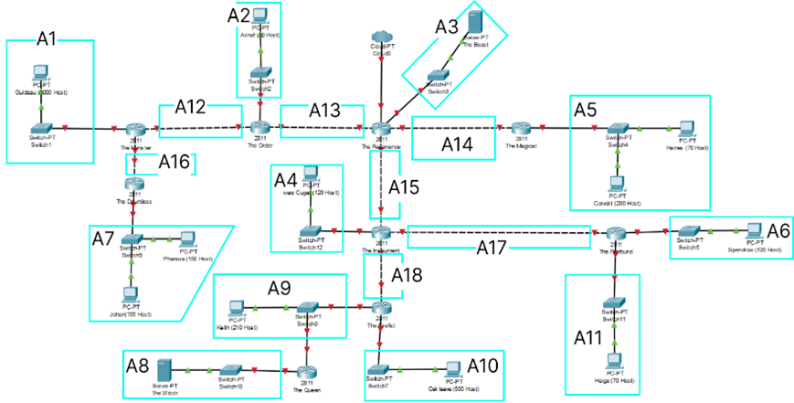

# Jarkom-Modul-4-ITB10-2022
| Nama | NRP |
| --- | --- |
| Jovan Surya Bako | 5027201013 |
| Gde Rio Aryaputra Rahadi | 5027201063 |

  

1. Soal shift dikerjakan pada Cisco Packet Tracer dan GNS3 menggunakan metode perhitungan CLASSLESS yang berbeda.
2. Keterangan: Bila di CPT menggunakan VLSM, maka di GNS3 menggunakan CIDR atau Sebaliknya
3. Untuk di GNS3 CLOUD merupakan NAT1 jangan sampai salah agar bisa terkoneksi internet.
4. Pembagian IP menggunakan Prefix IP yang telah ditentukan pada modul pengenalan
Pembagian IP dan routing harus SE-EFISIEN MUNGKIN.

berdasarkan soal dan topologi diatas, berikut hasil pengerjaan kami

# TOPOLOGI
 

# Tree
.png)

