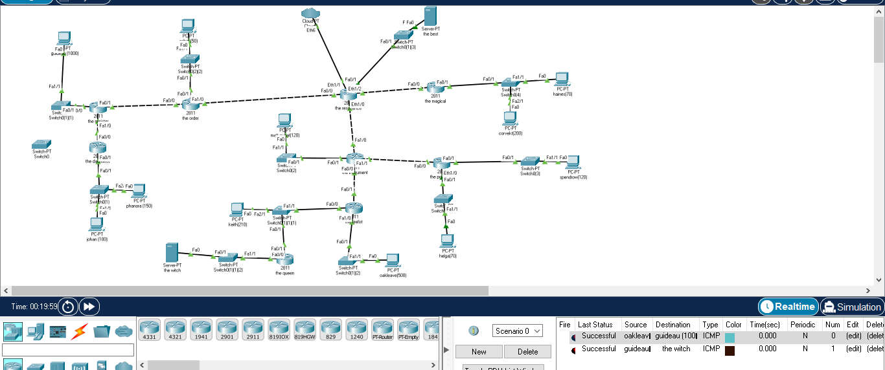
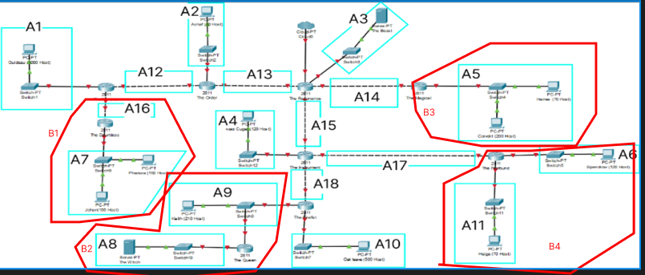
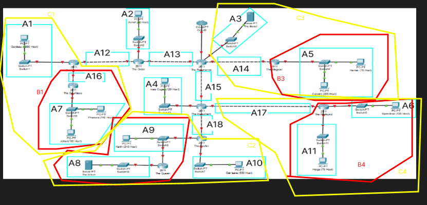
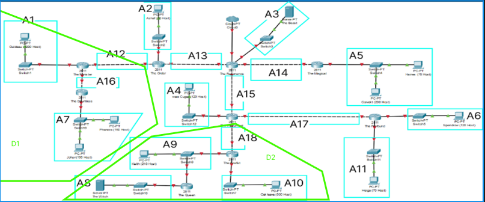
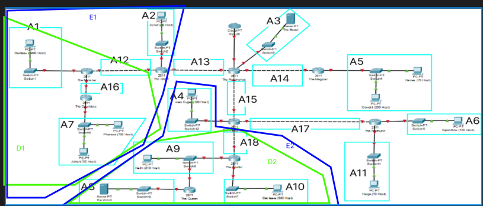
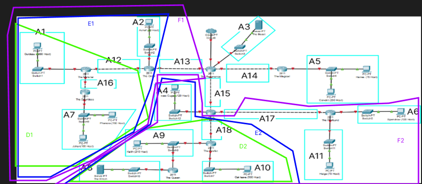
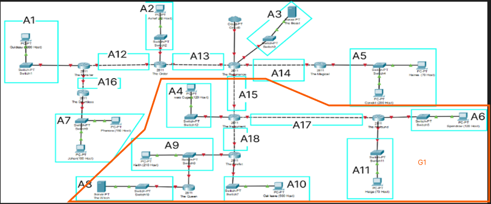
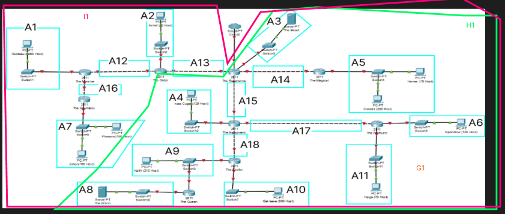
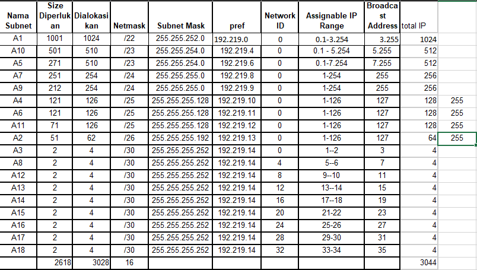

# Jarkom-Modul-4-ITB10-2022
| Nama | NRP |
| --- | --- |
| Jovan Surya Bako | 5027201013 |
| Gde Rio Aryaputra Rahadi | 5027201063 |

  

1. Soal shift dikerjakan pada Cisco Packet Tracer dan GNS3 menggunakan metode perhitungan CLASSLESS yang berbeda.
2. Keterangan: Bila di CPT menggunakan VLSM, maka di GNS3 menggunakan CIDR atau Sebaliknya
3. Untuk di GNS3 CLOUD merupakan NAT1 jangan sampai salah agar bisa terkoneksi internet.
4. Pembagian IP menggunakan Prefix IP yang telah ditentukan pada modul pengenalan
Pembagian IP dan routing harus SE-EFISIEN MUNGKIN.

# VLSM
berdasarkan soal dan topologi diatas, berikut hasil pengerjaan kami

# TOPOLOGI
 

# Tree
.png)

berdasarkan jumlah client yang diminta pada soal, kami membagikan ipnya seperti berikut berikut

lalu kami menambahkan ip pada tiap pc dan interface pada router seperti berikut

untuk pc

untuk roter 

lalu pada router sendiri diperlukan routing yang menggunakan metode statis, seperti contoh pada router the minister, ada total 2 routing, hal ini dikarenakan router tersebut terhubung langsung dengan dua router.

berikut adalah hasil routing yang sudah berhasil

# CIDR
Berikut langkah-langkah subnetting dan router menggunakan metode CIDR

untuk pembagian IPnya mirip seperti VLSM namun disini ada beberapa client yang saya tambahkan range IPnya sehingga dibutuhkan penambahan client maka tidak perlu perhitungan tambahan dan tidak akan overlap dengan client lain

